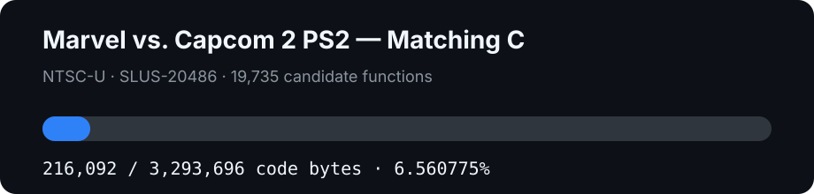

# Marvel vs. Capcom 2 PS2 decompilation

[](https://github.com/g-guthrie/mvc2-ps2-decomp/actions/workflows/report.yml)
[](https://decomp.dev/g-guthrie/mvc2-ps2-decomp)

[](DECOMP.md)

An early matching decompilation of **Marvel vs. Capcom 2: New Age of Heroes**
for PlayStation 2, targeting the NTSC-U executable `SLUS_204.86`.

This is a separate project from the Dreamcast decompilation. The PS2 port uses
the Emotion Engine's MIPS R5900 instruction set and identifies its original
compiler as `MW MIPS C Compiler (2.4.1.01)` / `PlayStation2`.

## Target

| Item | Value |
| --- | --- |
| Serial | `SLUS-20486` |
| ELF entry point | `0x00100008` |
| ELF SHA-1 | `dd8558a04891b0b1472ea1d8ae2bb84947ae8937` |
| ELF SHA-256 | `48ebf907d8149122ca9bd622ed11c290d5f93173078ea5bd570e1ac5566f13d7` |
| Loaded image | `0x00100000..0x004c2580` (`3,941,760` bytes) |
| Loaded-image SHA-1 | `a425c36425bbc1072114ea091ac4577c98c59a6a` |
| Conservative text | `0x00100000..0x00424200` (`3,293,696` bytes) |
| Initialized data | `0x00424200..0x004c2580` (`648,064` bytes) |
| BSS | `0x004c2580..0x00634380` (`0x171e00` bytes) |
| Global pointer | `0x004c7270` |

The project has **4,082 exact matching and linked C functions (135,296 bytes)**.
All are physically placed by the hybrid linker and covered by the exact
full-image hash. This is 4.1077% of the conservative text span and exceeds
decomp.dev's 0.5% public-visibility threshold. Assembly placeholders never
count as decompiled source. The initial inventory
contained 17,658 explicit-size function candidates. Splitting 2,077 oversized
dispatcher entries into exact C heads plus retained assembly residuals produces
a current denominator of **19,735 units**. No residual bytes were dropped; text
gaps and initialized data remain separately visible in the progress report.

Compiler-in-the-loop evidence currently identifies
`mwcps2-3.0.3-020716` as the strongest product-build candidate with an `-O3`
baseline. See [docs/COMPILER.md](docs/COMPILER.md); the exact getter matches do
not yet discriminate `-O3` from `-O4,p` or prove the retail small-data threshold.

## Setup

Use your own legally obtained NTSC-U PS2 disc dump. For a single-track
`MODE2/2352` BIN/CUE pair:

```sh
python3 -m venv .venv
.venv/bin/pip install -r requirements.txt
make setup BIN="/path/to/game.bin" CUE="/path/to/game.cue"
make split
```

`bchunk` and `7z` must be installed for `make setup`. All extracted game data,
generated assembly, and build output remain ignored.

## Exact hybrid relink baseline

The stripped retail image mixes instructions and initialized data inside one
RWX segment. Until every code/data boundary is represented semantically, the
baseline rawifies Splat's reviewed per-word payload comments before assembling.
This prevents GNU assembler pseudo-op expansion from changing retail bytes.

```sh
make split
make relink
```

`make relink` reconstructs all 3,941,760 loaded bytes, links BSS at
`0x004c2580`, and requires both SHA-1 and SHA-256 plus a byte-for-byte `cmp`.
`make hybrid` also deterministically reconstructs the full retail ELF
container—headers, program headers, section headers, `.comment`, `.reginfo`,
and padding—and requires it to match `SLUS_204.86` byte-for-byte.

## Matching-C verification

After placing private `wibo` and `mwcps2.exe` binaries outside Git:

```sh
WIBO=/private/path/wibo-macos \
MWCCPS2=/private/path/mwccps2.exe \
make match PYTHON=.venv/bin/python
```

The verifier applies MIPS HI16/LO16/26/32 relocations using the reviewed target
symbols before comparing every function directly with the retail loaded image.

`make hybrid` then replaces all matched retail windows with the actual compiled
Metrowerks function sections and requires exact symbol placement plus the full
loaded-image hashes and byte comparison.

## Progress reporting

```sh
make test
make report
```

The GitHub Actions workflow uploads a valid objdiff-v2 report as `ps2_report`,
which is the artifact consumed by decomp.dev.

## Runtime testing

The rebuilt ELF can eventually be inserted into a private disc image and tested
with PCSX2, AetherSX2, or real PS2 hardware. Emulator files are not part of this
repository.

## Legal

No disc image, executable, extracted asset, generated retail assembly, Sony SDK,
or proprietary Metrowerks binary is distributed. This research project is not
affiliated with Capcom, Marvel, Sony, or their licensors.
